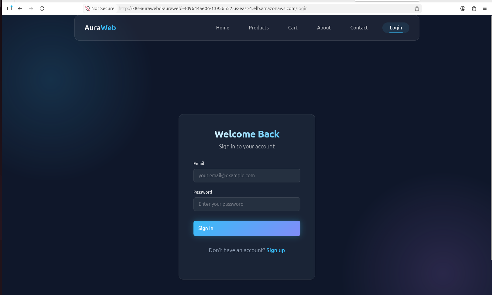
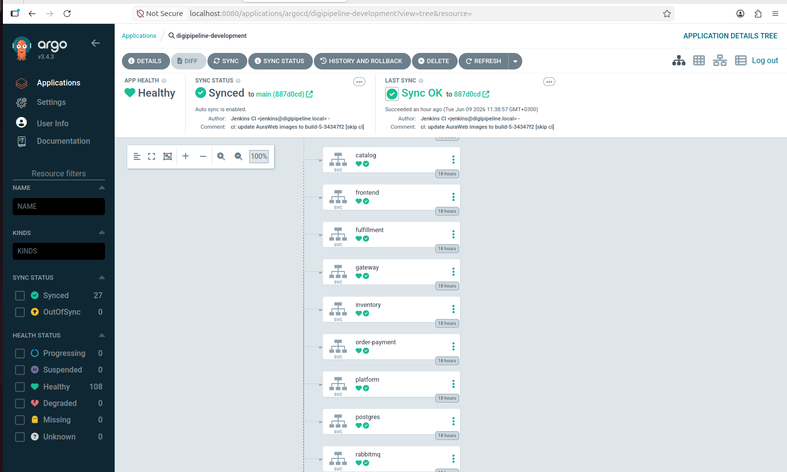
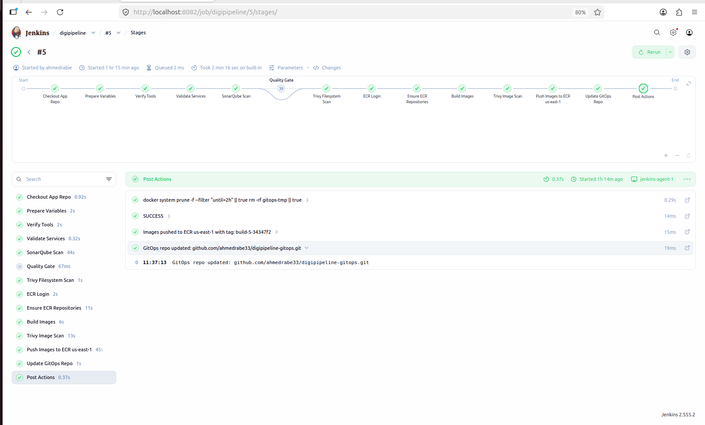
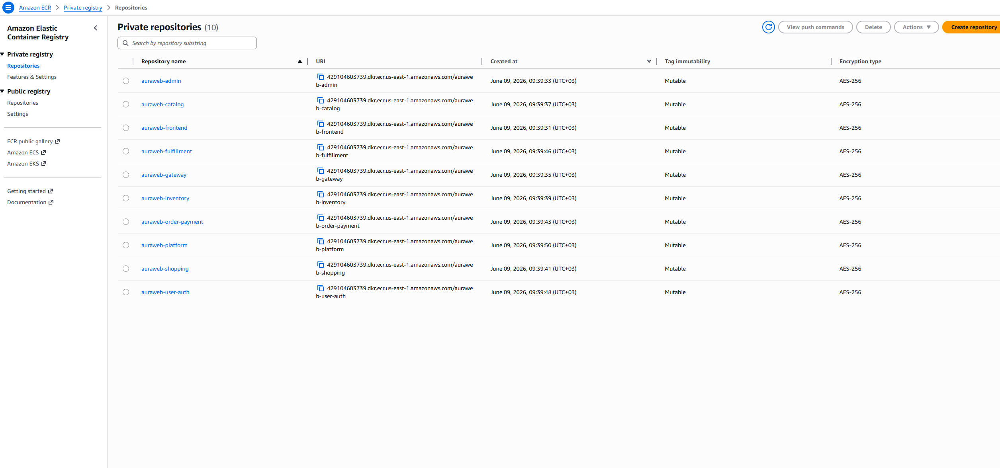
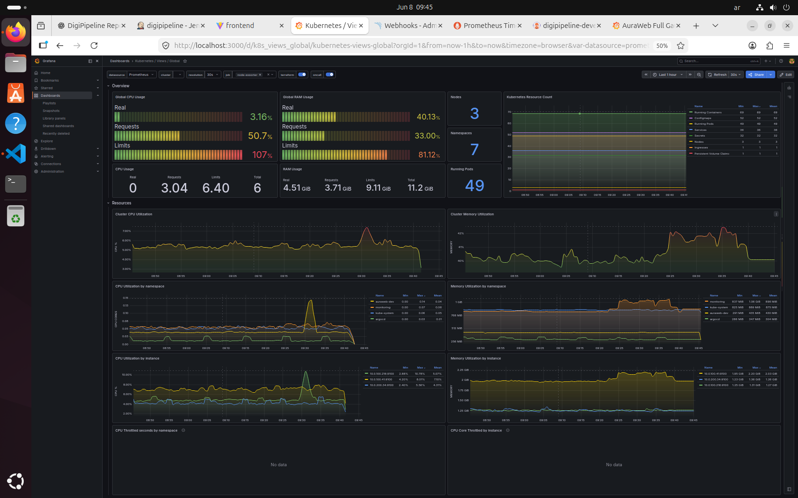
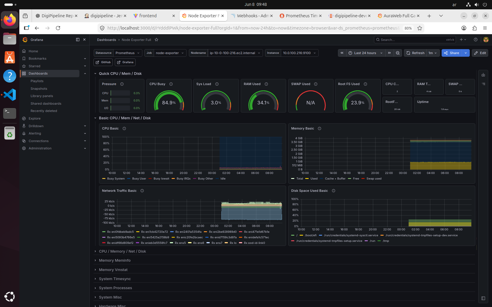

# DigiPipeline Infrastructure

> Reusable production-style DevOps infrastructure platform built with **Terraform**, **Ansible**, **AWS EKS**, **Jenkins**, **Argo CD**, **Karpenter**, **Amazon ECR**, **Prometheus**, **Grafana**, **SonarQube**, and **Trivy**.

---

## Overview

**DigiPipeline Infrastructure** is a reusable DevOps infrastructure platform designed to provision, configure, and operate a complete cloud-native delivery platform on AWS.

The main goal of this repository is automation and reusability.

DigiPipeline is not tied to one specific application.
It can be reused with most cloud-native projects by changing only the application-specific configuration.

For a new project, you mainly change:

* Application repository
* GitOps repository
* Application namespace
* Ingress name
* ECR repository name
* Application-specific variables and secrets

The same infrastructure platform can then build, scan, push, deploy, monitor, and expose the new application.

This repository automates:

* AWS infrastructure provisioning
* Private EKS cluster setup
* Bastion-based secure access
* Kubernetes platform installation
* GitOps deployment with Argo CD
* Jenkins controller and agents setup
* Jenkins credentials and integrations
* Amazon ECR integration
* SonarQube and Trivy DevSecOps setup
* Monitoring with Prometheus and Grafana
* Application secrets creation
* Optional database schema automation
* Local dashboard access tunnels
* Application URL and credentials output

Most of the platform can be rebuilt, configured, and accessed using one master Ansible playbook.

---

## Reusable Platform Quick Start

DigiPipeline is designed to be reused with different application projects.

The user provides:

```text
1. Application repository
2. GitOps repository
3. Application-specific values in .env
```

Then the full platform can be built using one command.

### 1. Clone the infrastructure repository

```bash
git clone https://github.com/ahmedrabe33/digipipeline-infra.git
cd digipipeline-infra
```

### 2. Create your environment configuration

```bash
cp .env.example .env
nano .env
```

Update the values for your own project:

```bash
DIGIPIPELINE_PROJECT_NAME=my-project
DIGIPIPELINE_ENVIRONMENT_NAME=development

DIGIPIPELINE_APP_NAME=myapp
DIGIPIPELINE_APP_NAMESPACE=myapp-dev
DIGIPIPELINE_APP_INGRESS_NAME=myapp-ingress
DIGIPIPELINE_APP_SECRET_NAME=app-secrets

DIGIPIPELINE_APP_REPO_URL=https://github.com/USERNAME/APP_REPO.git
DIGIPIPELINE_GITOPS_REPO_URL=https://github.com/USERNAME/GITOPS_REPO.git
DIGIPIPELINE_GITOPS_BRANCH=main
DIGIPIPELINE_GITOPS_APP_PATH=k8s/overlays/development

DIGIPIPELINE_ARGOCD_APP_NAME=my-project-development
DIGIPIPELINE_JENKINS_JOB_NAME=my-project
DIGIPIPELINE_ECR_REPOSITORY_NAME=myapp

DIGIPIPELINE_ENABLE_DB_SCHEMA_AUTOMATION=false
```

### 3. Run the full platform from zero

```bash
set -a && source .env && set +a && cd ansible && ansible-playbook playbooks/99-run-all-digipipeline.yml --tags "infra,all"
```

This command loads the project configuration from `.env`, then builds and configures the full DigiPipeline platform.

It automates:

* Terraform infrastructure provisioning
* Ansible inventory and variable generation
* Bastion access configuration
* Private EKS access configuration
* Argo CD installation
* AWS Load Balancer Controller installation
* Karpenter installation
* Prometheus and Grafana installation
* Application secrets creation
* GitOps application bootstrap
* Optional database schema automation
* Jenkins controller installation
* Jenkins agent preparation and registration
* Jenkins GitHub and ECR integration
* SonarQube and Trivy installation
* SonarQube token creation and Jenkins credential storage
* Final URLs, usernames, and passwords output

---

## Required Repository Structure for Reuse

DigiPipeline expects three repositories.

| Repository Type     | Purpose                                                             |
| ------------------- | ------------------------------------------------------------------- |
| Infrastructure Repo | Terraform and Ansible automation for the platform                   |
| Application Repo    | Application source code, Dockerfiles, and Jenkins pipeline          |
| GitOps Repo         | Kubernetes manifests, Kustomize overlays, and Argo CD desired state |

Example:

```text
Application code         -> your-app-repo
Kubernetes desired state -> your-gitops-repo
Infrastructure platform  -> digipipeline-infra
```

---

## Application Repository Requirements

Your application repository should contain the application source code and the CI/CD pipeline logic.

Recommended structure:

```text
your-app-repo/
|
|-- Dockerfile
|-- Jenkinsfile
|-- src/
|-- README.md
```

The Jenkins pipeline should be responsible for:

```text
Checkout application source code
        |
        v
Run tests and validations
        |
        v
Run SonarQube analysis
        |
        v
Run Trivy scans
        |
        v
Build Docker image
        |
        v
Push image to Amazon ECR
        |
        v
Update image tag in GitOps repository
```

---

## GitOps Repository Requirements

Your GitOps repository should contain Kubernetes manifests.

Recommended structure:

```text
your-gitops-repo/
|
|-- k8s/
    |
    |-- overlays/
        |
        |-- development/
            |
            |-- kustomization.yaml
            |-- deployment.yaml
            |-- service.yaml
            |-- ingress.yaml
            |-- configmap.yaml
```

The GitOps path must match the value in `.env`:

```bash
DIGIPIPELINE_GITOPS_APP_PATH=k8s/overlays/development
```

The Kubernetes namespace and ingress name should match `.env`:

```bash
DIGIPIPELINE_APP_NAMESPACE=myapp-dev
DIGIPIPELINE_APP_INGRESS_NAME=myapp-ingress
```

Example Ingress metadata:

```yaml
metadata:
  name: myapp-ingress
  namespace: myapp-dev
```

---

## Public and Private GitOps Repositories

Argo CD connects to the GitOps repository using the values from `.env`.

These values are used by the Argo CD Application:

```bash
DIGIPIPELINE_GITOPS_REPO_URL=https://github.com/USERNAME/GITOPS_REPO.git
DIGIPIPELINE_GITOPS_BRANCH=main
DIGIPIPELINE_GITOPS_APP_PATH=k8s/overlays/development
```

Argo CD uses:

```yaml
repoURL: DIGIPIPELINE_GITOPS_REPO_URL
targetRevision: DIGIPIPELINE_GITOPS_BRANCH
path: DIGIPIPELINE_GITOPS_APP_PATH
```

### Public GitOps Repository

If the GitOps repository is public, leave these values empty:

```bash
DIGIPIPELINE_ARGOCD_REPO_USERNAME=
DIGIPIPELINE_ARGOCD_REPO_PASSWORD=
```

### Private GitOps Repository

If the GitOps repository is private, set these values in `.env`:

```bash
DIGIPIPELINE_ARGOCD_REPO_USERNAME=YOUR_GITHUB_USERNAME
DIGIPIPELINE_ARGOCD_REPO_PASSWORD=YOUR_GITHUB_PERSONAL_ACCESS_TOKEN
```

Ansible will automatically register the GitOps repository credentials inside Argo CD as a Kubernetes Secret.

The credential task uses `no_log: true`, so the token does not appear in Ansible output.

> Do not commit `.env` to GitHub.

---

## Project Repositories

DigiPipeline follows a real production-style separation of responsibilities.

| Repository           | Responsibility                                                         |
| -------------------- | ---------------------------------------------------------------------- |
| `digipipeline-infra` | AWS infrastructure and platform automation using Terraform and Ansible |
| `your-app-repo`      | Application source code, Dockerfiles, and Jenkins pipeline             |
| `your-gitops-repo`   | Kubernetes manifests, Kustomize overlays, and Argo CD desired state    |

---

## What This Repository Automates

This repository automates the full DevOps platform lifecycle:

```text
Load project configuration from .env
        |
        v
Prepare SSH keys
        |
        v
Provision AWS infrastructure with Terraform
        |
        v
Generate Ansible inventory and variables
        |
        v
Configure Bastion access
        |
        v
Configure private EKS access
        |
        v
Install Kubernetes platform tools
        |
        v
Install Argo CD
        |
        v
Install AWS Load Balancer Controller
        |
        v
Install Karpenter
        |
        v
Install Prometheus and Grafana
        |
        v
Create application secrets
        |
        v
Bootstrap GitOps application
        |
        v
Apply optional database schema fixes
        |
        v
Install Jenkins controller
        |
        v
Prepare Jenkins agents automatically
        |
        v
Register Jenkins agents automatically
        |
        v
Configure Jenkins GitHub plugins
        |
        v
Configure Jenkins access to Amazon ECR
        |
        v
Install SonarQube and Trivy
        |
        v
Create or retrieve SonarQube token
        |
        v
Store SonarQube token inside Jenkins credentials
        |
        v
Show application URLs, dashboards, usernames, and passwords
```

---

## High-Level Architecture

```text
                              Developer
                                  |
                                  v
                           GitHub Repositories
                                  |
              ------------------------------------------------
              |                      |                       |
              v                      v                       v
        App Repository        GitOps Repository       Infrastructure Repo
              |                      |                       |
              |                      |                       v
              |                      |              Terraform + Ansible
              |                      |                       |
              |                      |                       v
              |                      |              AWS Infrastructure
              |                      |
              v                      |
        Jenkins CI/CD               |
        us-west-2                   |
              |                      |
              v                      |
       Build Docker Images          |
              |                      |
              v                      |
       Push Images to ECR           |
       us-east-1                    |
              |                      |
              v                      |
       Update GitOps Manifests -----|
                                     |
                                     v
                              Argo CD
                              us-east-1
                                     |
                                     v
                              Private EKS Cluster
                                     |
                  --------------------------------------------
                  |                    |                     |
                  v                    v                     v
        Application Workloads   Monitoring Stack      Platform Tools
        Microservices           Prometheus/Grafana    Argo CD/Karpenter
                  |
                  v
        AWS Load Balancer Controller
                  |
                  v
        Public Application Load Balancer
```

---

## Platform Screenshots

### Application Running Through AWS ALB

The application is exposed publicly using an AWS Application Load Balancer created by the AWS Load Balancer Controller.



---

### Argo CD GitOps Deployment

Argo CD manages the Kubernetes desired state and keeps the application synchronized with the GitOps repository.



---

### Jenkins CI/CD Pipeline

Jenkins builds application images, runs SonarQube and Trivy scans, pushes images to Amazon ECR, and updates the GitOps repository.



---

### Amazon ECR Images

Application Docker images are stored in Amazon ECR and referenced by Kubernetes manifests.



---

### Grafana Kubernetes Dashboard

Grafana provides Kubernetes cluster-level monitoring for CPU, memory, nodes, namespaces, pods, and resource usage.



---

### Node Exporter Dashboard

Node Exporter provides node-level monitoring for CPU, memory, disk, network traffic, and system load.



---

## Regional Architecture

DigiPipeline uses a multi-region AWS architecture.

### Primary Platform Region

```text
us-east-1
```

This region hosts the main Kubernetes and application platform.

Main resources in `us-east-1`:

* VPC
* Public subnets
* Private subnets
* Internet Gateway
* NAT Gateways
* Route tables
* Bastion host
* Private Amazon EKS cluster
* Managed node group
* Karpenter node provisioning
* Amazon ECR repositories
* Argo CD
* AWS Load Balancer Controller
* Prometheus
* Grafana
* Application workloads
* Persistent volumes using Amazon EBS

---

### CI Region

```text
us-west-2
```

This region hosts the external CI infrastructure.

Main resources in `us-west-2`:

* Jenkins controller EC2 instance
* Jenkins agent EC2 instances
* Jenkins security groups
* Docker build environment
* CI-related IAM permissions

Jenkins runs in `us-west-2`, builds Docker images, and pushes them cross-region to Amazon ECR in `us-east-1`.

---

## Network Architecture

The primary AWS platform is built inside a dedicated VPC in `us-east-1`.

```text
VPC - us-east-1
|
|-- Public Subnets
|   |
|   |-- Bastion Host
|   |-- NAT Gateways
|   |-- Internet-facing Application Load Balancer
|
|-- Private Subnets
    |
    |-- EKS Worker Nodes
    |-- Application Pods
    |-- Argo CD
    |-- Prometheus
    |-- Grafana
    |-- Karpenter-provisioned nodes
```

The EKS cluster is private and is not accessed directly from the public internet.

The Bastion host is used as the controlled access point for:

* `kubectl` access
* Helm operations
* EKS troubleshooting
* Argo CD bootstrap
* Monitoring verification
* Local SSH tunnels
* Access automation

All project operations are intended to be triggered from the local control machine using Ansible.

---

## Main Components

| Component                    | Purpose                                                  |
| ---------------------------- | -------------------------------------------------------- |
| Terraform                    | Provisions AWS infrastructure                            |
| Ansible                      | Configures infrastructure and platform tools             |
| Amazon VPC                   | Provides isolated networking                             |
| Public Subnets               | Host Bastion, NAT, and public ALB                        |
| Private Subnets              | Host EKS nodes and workloads                             |
| Bastion Host                 | Secure management entry point to the private EKS cluster |
| Amazon EKS                   | Kubernetes platform for application and tools            |
| Amazon ECR                   | Container image registry                                 |
| Jenkins                      | CI/CD pipeline engine                                    |
| Jenkins Agents               | Build Docker images and run pipeline steps               |
| Argo CD                      | GitOps deployment controller                             |
| Karpenter                    | Kubernetes node autoscaling and cost optimization        |
| AWS Load Balancer Controller | Creates AWS ALB from Kubernetes Ingress                  |
| Amazon EBS CSI Driver        | Enables persistent Kubernetes storage                    |
| PostgreSQL                   | Optional application database                            |
| Prometheus                   | Metrics collection                                       |
| Grafana                      | Metrics visualization                                    |
| SonarQube                    | Code quality analysis                                    |
| Trivy                        | Filesystem and container image security scanning         |

---

## Repository Structure

```text
digipipeline-infra/
|
|-- ansible/
|   |
|   |-- ansible.cfg
|   |
|   |-- inventories/
|   |   |
|   |   |-- dev/
|   |       |
|   |       |-- hosts.ini
|   |       |
|   |       |-- group_vars/
|   |           |
|   |           |-- all.yml.example
|   |
|   |-- playbooks/
|   |   |
|   |   |-- 00-ensure-keypairs.yml
|   |   |-- 00-rebuild-infra.yml
|   |   |-- 00-verify-cluster.yml
|   |   |-- 01-install-argocd.yml
|   |   |-- 02-argocd-password.yml
|   |   |-- 03-install-aws-load-balancer-controller.yml
|   |   |-- 04-install-ebs-csi-driver.yml
|   |   |-- 04-configure-default-storageclass.yml
|   |   |-- 06-install-karpenter.yml
|   |   |-- 09-install-monitoring.yml
|   |   |-- 10-install-platform.yml
|   |   |-- 11-bootstrap-gitops-app.yml
|   |   |-- 12-show-access-info.yml
|   |   |-- 13-create-app-secrets.yml
|   |   |-- 14-apply-db-schema.yml
|   |   |-- 20-install-jenkins-controller.yml
|   |   |-- 21-prepare-jenkins-agents.yml
|   |   |-- 22-show-ci-info.yml
|   |   |-- 24-install-sonarqube.yml
|   |   |-- 25-install-trivy.yml
|   |   |-- 26-open-sonarqube-access.yml
|   |   |-- 27-setup-sonarqube-for-jenkins.yml
|   |   |-- 27-verify-devsecops.yml
|   |   |-- 28-install-jenkins-sonarqube-plugin.yml
|   |   |-- 28-configure-prometheus.yml
|   |   |-- 29-install-jenkins-github-plugins.yml
|   |   |-- 30-install-ci.yml
|   |   |-- 31-install-devsecops.yml
|   |   |-- 32-configure-jenkins-agents.yml
|   |   |-- 32-configure-jenkins-ecr-iam.yml
|   |   |-- open-all-access.yml
|   |   |-- 99-run-all-digipipeline.yml
|   |
|   |-- README.md
|
|-- infra/
|   |
|   |-- terraform/
|       |
|       |-- backend.tf
|       |-- main.tf
|       |-- provider.tf
|       |-- variable.tf
|       |-- outputs.tf
|       |-- terraform.tfvars.example
|       |
|       |-- modules/
|           |
|           |-- vpc/
|           |-- iam/
|           |-- eks/
|           |-- bastion/
|           |-- karpenter/
|           |-- ecr/
|           |-- jenkins/
|       |
|       |-- README.md
|
|-- images/
|
|-- .env.example
|-- .gitignore
|-- README.md
```

> `ansible/inventories/dev/group_vars/all.yml` is generated automatically by the rebuild automation and should not be committed.

---

## Terraform Responsibilities

Terraform provisions the AWS infrastructure.

Terraform creates:

* VPC
* Public and private subnets
* Internet Gateway
* NAT Gateways
* Route tables
* EKS cluster
* Managed node group
* IAM roles and policies
* Bastion host
* Jenkins controller
* Jenkins agents
* Amazon ECR repositories
* Karpenter IAM resources
* EKS add-ons
* Security groups

Detailed Terraform documentation is maintained in:

```text
infra/terraform/README.md
```

---

## Ansible Responsibilities

Ansible automates the platform configuration and operational workflows.

Ansible automates:

* SSH key pair preparation
* Terraform execution
* Terraform output parsing
* Dynamic inventory updates
* Group variable updates
* Bastion configuration
* EKS kubeconfig setup
* Cluster verification
* EBS CSI Driver installation
* Default StorageClass configuration
* Argo CD installation
* AWS Load Balancer Controller installation
* Karpenter installation
* Prometheus and Grafana installation
* Application secrets creation
* GitOps application bootstrap
* Optional database schema fixes
* Jenkins controller installation
* Jenkins agent preparation
* Jenkins GitHub plugin setup
* Jenkins agent configuration
* Jenkins to ECR IAM configuration
* SonarQube installation
* Trivy installation
* SonarQube and Jenkins integration
* Local access tunnels
* Access information output

Detailed Ansible documentation is maintained in:

```text
ansible/README.md
```

---

## Configuration Using `.env`

The main user-facing configuration file is `.env`.

Start from the example:

```bash
cp .env.example .env
nano .env
```

Important variables:

| Variable                                   | Purpose                                           |
| ------------------------------------------ | ------------------------------------------------- |
| `DIGIPIPELINE_PROJECT_NAME`                | Logical project name                              |
| `DIGIPIPELINE_ENVIRONMENT_NAME`            | Environment name, such as development             |
| `DIGIPIPELINE_APP_NAME`                    | Application name                                  |
| `DIGIPIPELINE_APP_NAMESPACE`               | Kubernetes namespace for the app                  |
| `DIGIPIPELINE_APP_INGRESS_NAME`            | Kubernetes ingress name                           |
| `DIGIPIPELINE_APP_REPO_URL`                | Application source code repository                |
| `DIGIPIPELINE_GITOPS_REPO_URL`             | GitOps repository with Kubernetes manifests       |
| `DIGIPIPELINE_GITOPS_APP_PATH`             | Path inside GitOps repo watched by Argo CD        |
| `DIGIPIPELINE_ARGOCD_APP_NAME`             | Argo CD Application name                          |
| `DIGIPIPELINE_JENKINS_JOB_NAME`            | Jenkins job name                                  |
| `DIGIPIPELINE_ECR_REPOSITORY_NAME`         | ECR repository used for application images        |
| `DIGIPIPELINE_ENABLE_DB_SCHEMA_AUTOMATION` | Enables or disables built-in DB schema automation |
| `DIGIPIPELINE_ARGOCD_REPO_USERNAME`        | Optional username for private GitOps repo         |
| `DIGIPIPELINE_ARGOCD_REPO_PASSWORD`        | Optional token/password for private GitOps repo   |

---

## One-Command Platform Deployment

After editing `.env`, run:

```bash
set -a && source .env && set +a && cd ansible && ansible-playbook playbooks/99-run-all-digipipeline.yml --tags "infra,all"
```

This command performs the complete setup flow:

```text
Load .env configuration
        |
        v
Prepare SSH keys
        |
        v
Provision infrastructure with Terraform
        |
        v
Update Ansible inventory and group variables
        |
        v
Configure Bastion and kubeconfig
        |
        v
Verify EKS cluster access
        |
        v
Install platform components
        |
        v
Install Argo CD
        |
        v
Install AWS Load Balancer Controller
        |
        v
Install Karpenter
        |
        v
Install monitoring stack
        |
        v
Create application secrets
        |
        v
Bootstrap GitOps application
        |
        v
Apply optional database schema automation
        |
        v
Install Jenkins CI
        |
        v
Prepare and register Jenkins agents automatically
        |
        v
Configure Jenkins plugins and ECR access
        |
        v
Install SonarQube and Trivy
        |
        v
Store SonarQube token inside Jenkins credentials
        |
        v
Print access information
```

---

## Normal Re-run Without Rebuilding Infrastructure

If the AWS infrastructure already exists and only the platform needs to be reconfigured or repaired, run:

```bash
set -a && source .env && set +a && cd ansible && ansible-playbook playbooks/99-run-all-digipipeline.yml
```

This is useful when you want to re-run automation without recreating Terraform infrastructure.

---

## Open All Dashboards and Show Access URLs

After the platform is installed, local dashboard access can be opened with:

```bash
cd ansible
ansible-playbook playbooks/99-run-all-digipipeline.yml --tags access
```

Or directly:

```bash
cd ansible
ansible-playbook playbooks/open-all-access.yml
```

This opens local access to the main platform tools:

| Tool       | Local URL               |
| ---------- | ----------------------- |
| Argo CD    | `http://localhost:8080` |
| Jenkins    | `http://localhost:8082` |
| SonarQube  | `http://localhost:9000` |
| Grafana    | `http://localhost:3000` |
| Prometheus | `http://localhost:9090` |

If local ports are already busy, clean old tunnels first:

```bash
pkill -f "ssh -f -N" || true
pkill -f "kubectl.*port-forward" || true
```

Then run:

```bash
ansible-playbook playbooks/open-all-access.yml
```

---

## Show URLs, Usernames, and Passwords

To print the application URL and platform credentials, run:

```bash
cd ansible

ansible-playbook playbooks/12-show-access-info.yml
ansible-playbook playbooks/22-show-ci-info.yml
```

These playbooks show important access information such as:

* Application URL
* Argo CD URL
* Argo CD admin password
* Jenkins URL
* Jenkins initial admin password
* Grafana URL
* Grafana username and password
* SonarQube URL
* SonarQube username and password
* ECR repository information

Typical development access values:

| Tool      | Username | Password                             |
| --------- | -------- | ------------------------------------ |
| Argo CD   | `admin`  | Printed by `12-show-access-info.yml` |
| Jenkins   | `admin`  | Printed by `22-show-ci-info.yml`     |
| Grafana   | `admin`  | `admin123`                           |
| SonarQube | `admin`  | `Admin@12345`                        |

> These are development/demo credentials. Do not commit real production passwords, tokens, private keys, kubeconfig files, Terraform state files, or real `.tfvars` files to Git.

---

## CI/CD and GitOps Flow

DigiPipeline separates CI and CD responsibilities.

### CI Responsibility

Jenkins is responsible for:

* Checking out source code from the application repository
* Installing dependencies
* Running tests and validations
* Running SonarQube analysis
* Running Trivy scans
* Building Docker images
* Pushing Docker images to Amazon ECR in `us-east-1`
* Updating image tags in the GitOps repository

---

### CD Responsibility

Argo CD is responsible for:

* Watching the GitOps repository
* Detecting Kubernetes manifest changes
* Syncing application resources to EKS
* Maintaining desired state
* Showing sync and health status

---

### Full Delivery Flow

```text
Developer pushes code
        |
        v
Application repository
        |
        v
Jenkins pipeline starts
        |
        v
Build and test application
        |
        v
Run SonarQube and Trivy checks
        |
        v
Build Docker image
        |
        v
Push image to Amazon ECR
        |
        v
Update image tag in GitOps repository
        |
        v
Argo CD detects GitOps change
        |
        v
Argo CD syncs application to EKS
        |
        v
AWS Load Balancer Controller exposes application through ALB
```

---

## After a Fresh Rebuild

After a fresh rebuild, Amazon ECR may be empty.

Open Jenkins and run the application pipeline:

```text
Jenkins -> your job name -> Build Now
```

The Jenkins pipeline will:

```text
Checkout application source code
        |
        v
Run SonarQube analysis
        |
        v
Run Trivy scans
        |
        v
Build Docker image
        |
        v
Push image to Amazon ECR
        |
        v
Update image tag in GitOps repository
        |
        v
Argo CD syncs the application to EKS
```

After the Jenkins build finishes, verify the deployment:

```bash
cd ansible

ansible bastion -m shell -a '
kubectl --kubeconfig "$HOME/.kube/config" -n argocd get application
'

ansible bastion -m shell -a "
kubectl --kubeconfig \"\$HOME/.kube/config\" -n $DIGIPIPELINE_APP_NAMESPACE get pods
"
```

Expected result:

```text
Argo CD: Synced / Healthy
Pods: Running
```

---

## Application Secrets

Application secrets are created using Ansible before GitOps workloads are deployed.

The secrets playbook is:

```bash
cd ansible
ansible-playbook playbooks/13-create-app-secrets.yml
```

It creates and updates the Kubernetes secret defined by:

```bash
DIGIPIPELINE_APP_SECRET_NAME=app-secrets
```

The secret includes keys such as:

* `DB_NAME`
* `DB_USER`
* `DB_PASSWORD`
* `DB_HOST`
* `DB_PORT`
* `POSTGRES_DB`
* `POSTGRES_USER`
* `POSTGRES_PASSWORD`
* `DATABASE_URL`
* `JWT_SECRET`
* `REDIS_HOST`
* `REDIS_PORT`
* `REDIS_URL`
* `RABBITMQ_HOST`
* `RABBITMQ_PORT`
* `RABBITMQ_USER`
* `RABBITMQ_PASS`
* `RABBITMQ_URL`
* `AMQP_URL`

This prevents workloads from failing with missing secret keys after a fresh rebuild.

---

## Database Schema Automation

Database schema automation is optional.

It can be enabled or disabled from `.env`:

```bash
DIGIPIPELINE_ENABLE_DB_SCHEMA_AUTOMATION=false
```

Use `false` when the new application has its own schema management, migrations, or a different database structure.

Use `true` only when the application is compatible with the provided PostgreSQL schema automation.

The database schema playbook is:

```bash
cd ansible
ansible-playbook playbooks/14-apply-db-schema.yml
```

Example schema tasks when enabled:

* Ensure the `users` table exists
* Ensure `password_hash` exists
* Verify `users` table structure
* Apply compatibility fixes for authentication services

---

## Persistent Storage

DigiPipeline supports persistent Kubernetes workloads using Amazon EBS volumes.

PostgreSQL can use:

* StatefulSet
* PersistentVolumeClaim
* `gp3` StorageClass
* AWS EBS CSI Driver

The StorageClass configuration is automated using Ansible:

```bash
cd ansible
ansible-playbook playbooks/04-configure-default-storageclass.yml
```

This helps prevent PostgreSQL PVCs from staying in `Pending` state after a fresh rebuild.

---

## Monitoring

Monitoring is installed inside the EKS cluster.

The monitoring stack includes:

* Prometheus
* Grafana
* Kubernetes metrics collection
* Node Exporter metrics
* Cluster resource dashboards
* Node-level dashboards

Grafana is available locally after opening access tunnels:

```text
http://localhost:3000
```

Default development credentials:

```text
admin / admin123
```

---

## DevSecOps

The project includes DevSecOps automation using:

* SonarQube
* Trivy
* Jenkins integration
* ECR IAM configuration
* Jenkins GitHub plugin setup
* Jenkins agent configuration

The main DevSecOps automation playbook is:

```bash
cd ansible
ansible-playbook playbooks/31-install-devsecops.yml
```

SonarQube integration with Jenkins is automated using:

```bash
cd ansible
ansible-playbook playbooks/27-setup-sonarqube-for-jenkins.yml
```

This playbook creates or retrieves a SonarQube token and stores it inside Jenkins credentials automatically.

---

## Jenkins Automation

Jenkins is configured through Ansible automation.

The project does not require manually adding Jenkins agents after every rebuild.

Ansible handles:

* Jenkins controller installation
* Jenkins agent machine preparation
* Required packages installation on agents
* SSH access between Jenkins controller and agents
* Jenkins node registration
* Jenkins agent labels
* Docker build environment preparation
* Jenkins GitHub plugins
* Jenkins access to Amazon ECR

Main playbooks:

```bash
cd ansible

ansible-playbook playbooks/20-install-jenkins-controller.yml
ansible-playbook playbooks/21-prepare-jenkins-agents.yml
ansible-playbook playbooks/32-configure-jenkins-agents.yml
ansible-playbook playbooks/32-configure-jenkins-ecr-iam.yml
```

This means Jenkins agents are prepared and attached automatically by Ansible.

---

## Prerequisites

Before running the project, install and configure:

* AWS CLI
* Terraform
* Ansible
* kubectl
* Helm
* Git
* SSH client
* AWS account with required permissions
* GitHub repositories for app and GitOps manifests

Check AWS identity:

```bash
aws sts get-caller-identity
```

Check required tools:

```bash
terraform version
ansible --version
kubectl version --client
helm version
aws --version
git --version
```

---

## Terraform Backend

Terraform uses a remote backend for state management.

Backend components:

| Service   | Purpose                          |
| --------- | -------------------------------- |
| Amazon S3 | Stores Terraform state           |
| DynamoDB  | Provides Terraform state locking |

Before running the platform, update:

```text
infra/terraform/backend.tf
```

with your own backend resources.

Example backend configuration:

```hcl
terraform {
  backend "s3" {
    bucket         = "your-terraform-state-bucket"
    key            = "eks-ha-karpenter/terraform.tfstate"
    region         = "us-east-1"
    dynamodb_table = "your-terraform-lock-table"
    encrypt        = true
    profile        = "default"
  }
}
```

> The S3 bucket and DynamoDB table must exist before running `terraform init`.

Do not delete the backend S3 bucket or DynamoDB lock table unless you intentionally want to remove Terraform state management.

---

## Useful Commands

### Check EKS Nodes

```bash
cd ansible

ansible bastion -m shell -a '
kubectl --kubeconfig "$HOME/.kube/config" get nodes -o wide
'
```

---

### Check All Pods

```bash
cd ansible

ansible bastion -m shell -a '
kubectl --kubeconfig "$HOME/.kube/config" get pods -A
'
```

---

### Check Application Pods

```bash
cd ansible

ansible bastion -m shell -a "
kubectl --kubeconfig \"\$HOME/.kube/config\" -n $DIGIPIPELINE_APP_NAMESPACE get pods
"
```

---

### Check Services and Ingress

```bash
cd ansible

ansible bastion -m shell -a "
kubectl --kubeconfig \"\$HOME/.kube/config\" -n $DIGIPIPELINE_APP_NAMESPACE get svc,ingress
"
```

---

### Get Application URL

```bash
cd ansible

ansible-playbook playbooks/12-show-access-info.yml
```

Or directly:

```bash
ansible bastion -m shell -a "
kubectl --kubeconfig \"\$HOME/.kube/config\" -n $DIGIPIPELINE_APP_NAMESPACE get ingress $DIGIPIPELINE_APP_INGRESS_NAME \
-o jsonpath='{.status.loadBalancer.ingress[0].hostname}{\"\n\"}'
"
```

---

### Check Persistent Volume Claims

```bash
cd ansible

ansible bastion -m shell -a "
kubectl --kubeconfig \"\$HOME/.kube/config\" -n $DIGIPIPELINE_APP_NAMESPACE get pvc
"
```

---

### Check Current Deployed Image

```bash
cd ansible

ansible bastion -m shell -a "
kubectl --kubeconfig \"\$HOME/.kube/config\" -n $DIGIPIPELINE_APP_NAMESPACE get deployments -o wide
"
```

---

### Check Application Logs

```bash
cd ansible

ansible bastion -m shell -a "
kubectl --kubeconfig \"\$HOME/.kube/config\" -n $DIGIPIPELINE_APP_NAMESPACE get pods
"
```

Then check logs for the required deployment or pod:

```bash
ansible bastion -m shell -a "
kubectl --kubeconfig \"\$HOME/.kube/config\" -n $DIGIPIPELINE_APP_NAMESPACE logs deployment/YOUR_DEPLOYMENT_NAME --tail=150
"
```

---

## Destroy Infrastructure

To destroy all Terraform-managed resources:

```bash
cd infra/terraform

terraform init
terraform plan -destroy -out=destroy.tfplan
terraform apply destroy.tfplan
```

If a Terraform lock remains from a previous interrupted operation, unlock it carefully using the lock ID shown in the Terraform error:

```bash
terraform force-unlock -force <LOCK_ID>
```

---

## Clean ECR Before Destroy

If ECR repositories contain images, clean them before destroying the infrastructure:

```bash
for REPO in $(aws ecr describe-repositories \
  --region us-east-1 \
  --query "repositories[].repositoryName" \
  --output text); do

  echo "Cleaning ECR repo: $REPO"

  IMAGES=$(aws ecr list-images \
    --region us-east-1 \
    --repository-name "$REPO" \
    --query 'imageIds[*]' \
    --output json)

  if [ "$IMAGES" != "[]" ]; then
    aws ecr batch-delete-image \
      --region us-east-1 \
      --repository-name "$REPO" \
      --image-ids "$IMAGES" || true
  fi
done
```

---

## Troubleshooting

### PostgreSQL PVC Stays Pending

Check PVC status:

```bash
cd ansible

ansible bastion -m shell -a "
kubectl --kubeconfig \"\$HOME/.kube/config\" -n $DIGIPIPELINE_APP_NAMESPACE get pvc
"
```

Check StorageClass:

```bash
ansible bastion -m shell -a '
kubectl --kubeconfig "$HOME/.kube/config" get storageclass
'
```

Run StorageClass automation:

```bash
ansible-playbook playbooks/04-configure-default-storageclass.yml
```

---

### Missing `app-secrets`

If pods fail with:

```text
secret "app-secrets" not found
```

Run:

```bash
cd ansible
ansible-playbook playbooks/13-create-app-secrets.yml
```

Then restart affected pods:

```bash
ansible bastion -m shell -a "
kubectl --kubeconfig \"\$HOME/.kube/config\" -n $DIGIPIPELINE_APP_NAMESPACE rollout restart deployment
"
```

---

### Database Schema Mismatch

If backend logs show database schema errors and your app supports the provided schema automation, enable it in `.env`:

```bash
DIGIPIPELINE_ENABLE_DB_SCHEMA_AUTOMATION=true
```

Then run:

```bash
cd ansible
ansible-playbook playbooks/14-apply-db-schema.yml
```

If your app has its own migrations, keep this disabled and run your own migration process.

---

### Argo CD Shows OutOfSync or Degraded

Check Argo CD resources:

```bash
cd ansible

ansible bastion -m shell -a "
kubectl --kubeconfig \"\$HOME/.kube/config\" -n argocd get application $DIGIPIPELINE_ARGOCD_APP_NAME \
-o jsonpath='{range .status.resources[*]}{.kind}{\"\t\"}{.namespace}{\"\t\"}{.name}{\"\t\"}{.status}{\"\t\"}{.health.status}{\"\n\"}{end}'
"
```

Common causes:

* Pending PVC
* ImagePullBackOff
* ErrImageNeverPull
* CreateContainerConfigError
* Missing Secret
* Missing ConfigMap
* Wrong image tag
* Empty ECR repository after rebuild
* Kustomize patch error
* StatefulSet immutable field change
* Private GitOps repository credentials are missing

---

### Jenkins Is Not Opening Locally

Open access tunnels:

```bash
cd ansible
ansible-playbook playbooks/99-run-all-digipipeline.yml --tags access
```

If local ports are busy:

```bash
pkill -f "ssh -f -N" || true
pkill -f "kubectl.*port-forward" || true
```

Then run:

```bash
ansible-playbook playbooks/open-all-access.yml
```

---

## Security Notes

This project uses temporary public access for learning and demonstration purposes.

Recommended production improvements:

* Use private Jenkins access through VPN, SSM, or private networking
* Avoid exposing Jenkins directly to the internet
* Store secrets in AWS Secrets Manager or External Secrets Operator
* Use Jenkins credentials securely
* Enable HTTPS using ACM and Route 53
* Restrict security groups to trusted IP addresses
* Enable CloudWatch logs and Kubernetes audit logging
* Add backup and disaster recovery strategy
* Use least privilege IAM policies
* Use IRSA for Kubernetes service accounts
* Use private container registry access controls
* Enable image signing and policy enforcement

Do not commit:

* `.env`
* Real passwords
* Tokens
* Private keys
* kubeconfig files
* Terraform state files
* Sensitive `.tfvars` files
* Generated `ansible/inventories/dev/group_vars/all.yml`

---

## What This Project Demonstrates

This project demonstrates practical DevOps and Cloud Engineering skills:

* Reusable DevOps platform design
* Infrastructure as Code with Terraform
* Configuration automation with Ansible
* AWS multi-region infrastructure design
* AWS networking and subnet design
* Private EKS cluster provisioning
* Bastion-based secure cluster access
* CI infrastructure with Jenkins
* Jenkins controller and agent automation
* Cross-region image push to Amazon ECR
* GitOps delivery with Argo CD
* Kubernetes deployment automation
* Persistent storage using EBS and PVCs
* Monitoring with Prometheus and Grafana
* DevSecOps with SonarQube and Trivy
* Karpenter-based node provisioning
* Remote state management with S3 and DynamoDB
* End-to-end DevOps platform automation

---

## Tech Stack

| Category               | Tools                         |
| ---------------------- | ----------------------------- |
| Cloud                  | AWS                           |
| Infrastructure as Code | Terraform                     |
| Automation             | Ansible                       |
| Containers             | Docker                        |
| Orchestration          | Kubernetes / Amazon EKS       |
| CI/CD                  | Jenkins                       |
| GitOps                 | Argo CD                       |
| Registry               | Amazon ECR                    |
| Security Scanning      | Trivy                         |
| Code Quality           | SonarQube                     |
| Monitoring             | Prometheus                    |
| Dashboards             | Grafana                       |
| Scaling                | Karpenter                     |
| Access                 | Bastion Host / SSH Tunnels    |
| State Management       | S3 Backend / DynamoDB Locking |

---

## Project Status

| Area                                | Status      |
| ----------------------------------- | ----------- |
| Reusable project configuration      | Implemented |
| One-command platform deployment     | Implemented |
| Infrastructure automation           | Implemented |
| EKS provisioning                    | Implemented |
| Bastion access                      | Implemented |
| Jenkins controller setup            | Implemented |
| Jenkins agents setup                | Implemented |
| ECR integration                     | Implemented |
| Argo CD setup                       | Implemented |
| Public GitOps repository support    | Implemented |
| Private GitOps repository support   | Implemented |
| GitOps app bootstrap                | Implemented |
| Application secrets automation      | Implemented |
| Optional database schema automation | Implemented |
| Monitoring setup                    | Implemented |
| Persistent storage automation       | Implemented |
| DevSecOps tooling                   | Implemented |
| Access automation                   | Implemented |

---

## Author

**Ahmed Rabie**
DevOps Engineer

GitHub: [ahmedrabe33](https://github.com/ahmedrabe33)

Built as part of the **DigiPipeline DevOps Project**.
